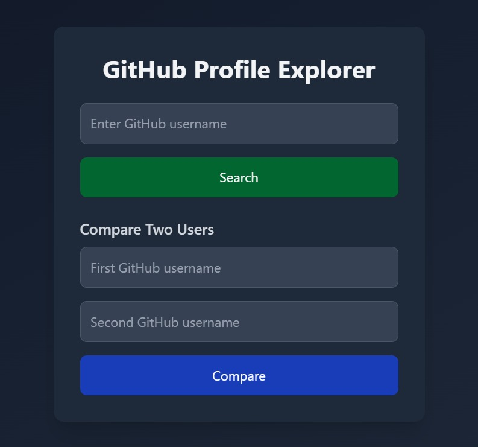
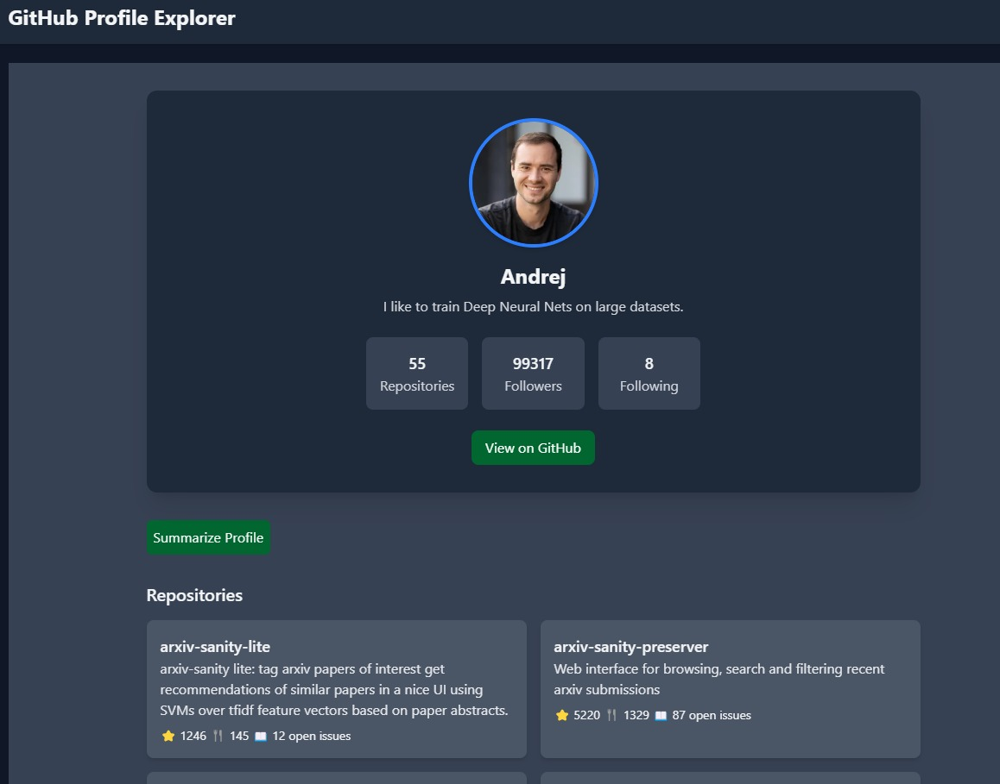
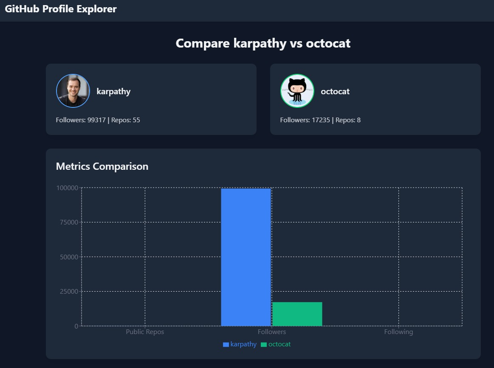

# GitHub Profile Explorer 

Welcome to the GitHub Profile Explorer, a tool to dive into GitHub profiles, compare your favorite developers, and get profile summaries powered by AI!  Built with Next.js, this app lets you explore user stats, repo details, and more! 

##  Overview

The GitHub Profile Explorer is your one-stop destination to analyze and compare GitHub profiles. Whether you want to check out a single user's stats, pit two developers against each other in a metric battle, or get a concise AI-generated summary of their profile

##  Features

-  **Profile Explorer**: View detailed stats (repos, followers, following) for any GitHub user.
-  **Head-to-Head Comparison**: Compare two users across multiple metrics.
-  **AI-Powered Summaries**: Get a smart summary of a user's profile using Hugging Face's AI.
-  **Dynamic Data**: Fetches real-time data from the GitHub API.

##  Installation

Want to run this app locally? Follow these steps:

### Clone the Repo:
```bash
git clone https://github.com/sara12312/github-explorer.git
cd github-explorer
```

### Install Dependencies:
```bash
npm install
```

### Set Up Environment Variables:
1. Create a `.env.local` file in the root directory.
2. Add your Hugging Face token:
```env
HUGGING_FACE_TOKEN=your-hugging-face-token-here
```
3. Get your tokens from Hugging Face.

### Run the App:
```bash
npm run dev
```
Open http://localhost:3000 in your browser 

##  Usage

### Explore a Single Profile
1. Visit the homepage.
2. Enter a GitHub username (e.g., octocat) in the "Enter GitHub username" field.
3. Click "Search" to view the user's profile, repos, and summarize their data with the "Summarize Profile" button.

### Compare Two Users
1. On the homepage, enter the first username in "First GitHub username".
2. Enter the second username in "Second GitHub username".
3. Click "Compare" to see a side-by-side comparison with a chart showing repos, followers, following.


##  Tech Stack

Built with:

- **Next.js**: The powerhouse framework for a fast app.
- **Tailwind CSS**: For customizable dark theme.
- **Recharts**: Crafting good comparison charts.
- **Axios**: Handling API calls.
- **Hugging Face API**: For AI summaries.


## 🎨 Screenshots



 
